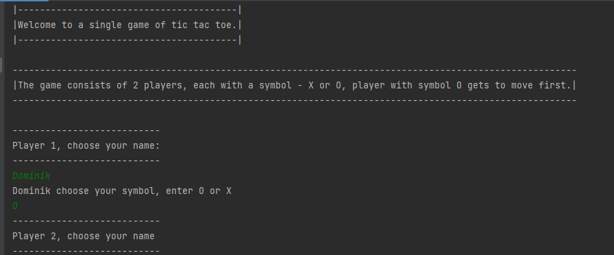
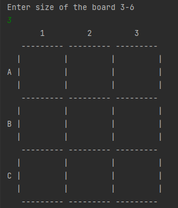
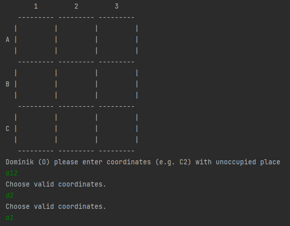
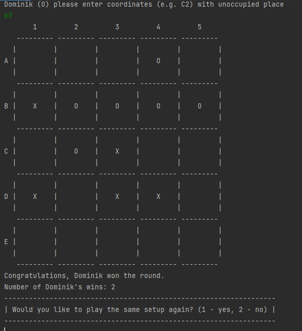

# Project Name
Console game of TicTacToe between 2 players.        a
This part of the project is released as a library, in order to practice using maven and to simulate usage of external 
library in my other projects. Console part of the TicTacToe can be found here: https://github.com/DominikSzczesniak/console-tic-tac-toe-app

## Table of Contents
* [General Info](#general-information)
* [Technologies Used](#technologies-used)
* [Features](#features)
* [Screenshots](#screenshots)
* [Project Status](#project-status)
* [Room for Improvement](#room-for-improvement)

## General Information
- It is my first bigger project.
- The purpose of the project was to use theoretical knowledge of OOP and SOLID in practice.
- Project architecture focused on ports and adapters.
- Application was made with TDD in mind.

## Technologies Used
- Java - version 17.0.5
- Maven
- GIT

## Features
- Game supports board sizes of 3-6.
- Application keeps track of game history and players' ID in .txt files.

## Screenshots
**Preparing the game** 

 

**Attempts to place symbol in non-existing fields**

**Game resolve**

## Project Status
Project is finished.

## Room for Improvement
- Make it possible to play against a computer.